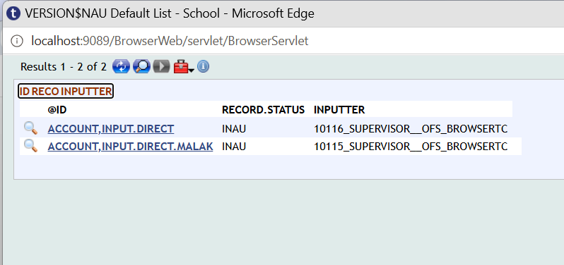

## create new customer

## customer authorization 

## copying supervisor

## paste supervisor

## authorization to new customer
.png.png)

## create new version

## UNAUTH

## auth & change no of auth to 0
